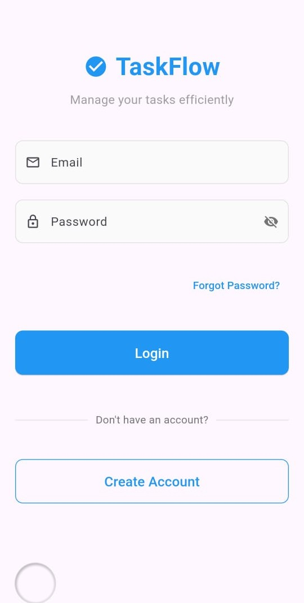
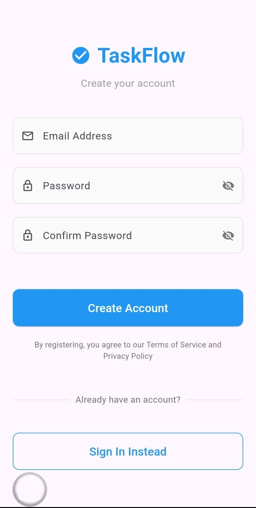
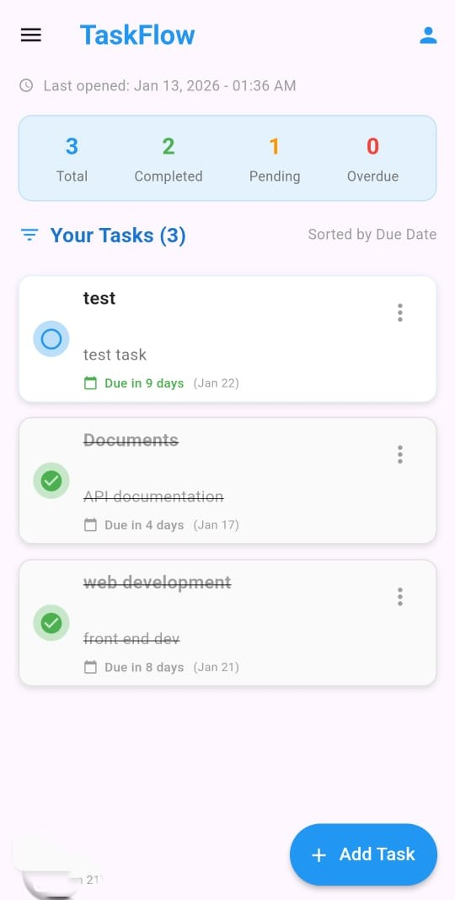
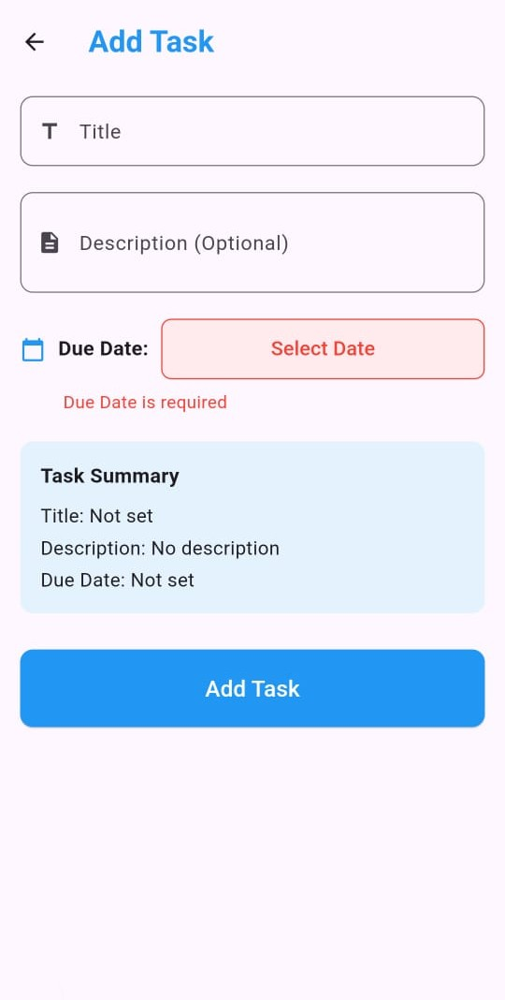
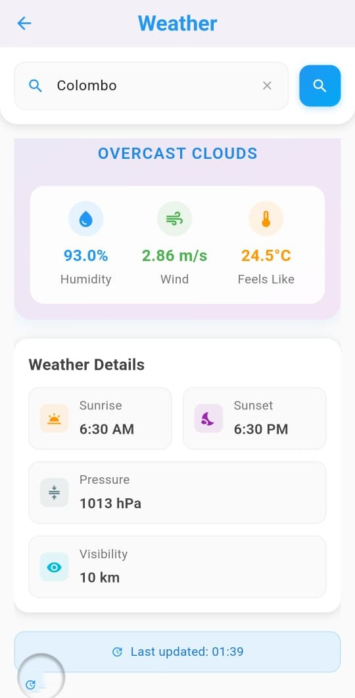
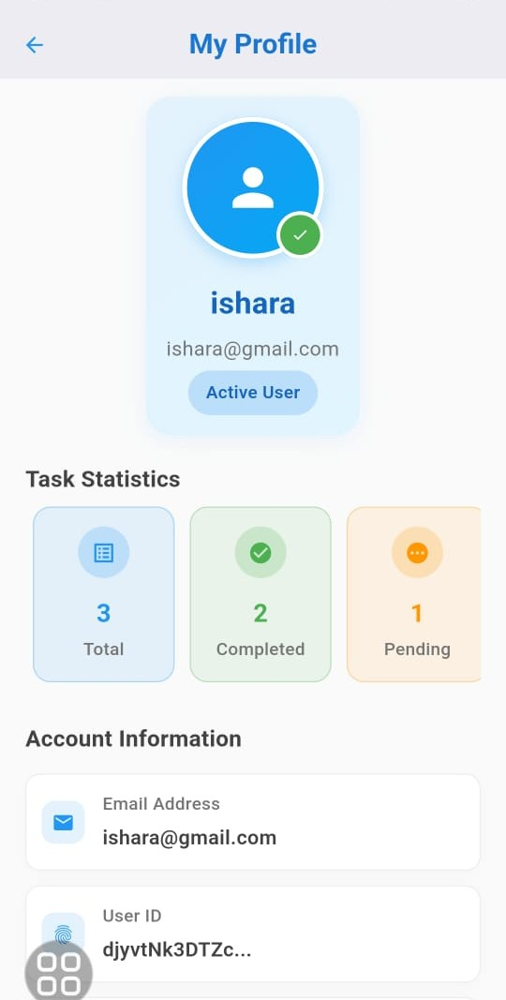

# **TaskFlow - Task Management Mobile App**


A feature-rich task management application built with Flutter, featuring Firebase authentication, cloud database, and weather API integration.

## * Screenshots

| Login Screen | Register Screen | Home Screen |
|--------------|-----------------|-------------|
|  |  |  |

| Add Task | Weather | Profile |
|----------|---------|---------|
|  |  |  |

## * Features

### + **Authentication**
- Email/Password sign up and login using Firebase Auth
- Secure session management with Shared Preferences
- Comprehensive error handling for auth scenarios
- Logout functionality

### + **Task Management**
- **Create**: Add new tasks with title, description, due date, and priority
- **Read**: View tasks in organized lists with sorting options
- **Update**: Edit existing tasks or mark as complete/incomplete
- **Delete**: Remove tasks with confirmation dialog
- **Real-time sync**: Instant updates with Firebase Firestore

### + **Local Storage**
- Persistent login state using Shared Preferences
- Last app open time tracking and display
- User preferences storage

### + **API Integration**
- Real-time weather data from OpenWeatherMap API
- Location-based weather information
- Loading states, error handling, and success displays
- Dedicated weather screen with detailed information

### + **User Interface**
- Responsive design using MediaQuery
- Clean, modern Material Design
- Dark mode ready (theme configurable)
- Adaptive layouts for different screen sizes
- No hard-coded dimensions

## * Project Structure

```
lib/
│
├── constants/                 # App constants
│   └── app_constants.dart    # Shared constants and configurations
│
├── models/                    # Data models
│   ├── task_model.dart       # Task data structure
│   └── weather_model.dart    # Weather data structure
│
├── screens/                   # App screens
│   ├── base_auth_screen.dart # Shared auth screen functionality
│   ├── login_screen.dart     # User login
│   ├── register_screen.dart  # User registration
│   ├── home_screen.dart      # Main task list
│   ├── add_edit_taskscreen.dart # Task creation/editing
│   ├── profile_screen.dart   # User profile
│   └── weather_screen.dart   # Weather information
│
├── services/                  # Business logic
│   ├── auth_service.dart     # Authentication service
│   ├── firestore_service.dart # Firebase database operations
│   ├── weather_service.dart  # Weather API integration
│   └── shared_pref_service.dart # Local storage
│
├── utils/                     # Utilities
│   ├── responsive.dart       # Responsive design helpers
│   ├── validators.dart       # Form validation
│   └── auth_error_handler.dart # Auth error handling
│
├── widgets/                   # Reusable widgets
│   ├── auth_header_widget.dart     # Auth screen header
│   ├── auth_text_field_widget.dart # Custom text field
│   ├── auth_error_message_widget.dart # Error display
│   └── task_tile_widget.dart       # Task list item
│
└── main.dart                 # App entry point
```

## * Getting Started

### Prerequisites

- **Flutter SDK** (latest stable version)
- **Dart** (included with Flutter)
- **Firebase Account** (free tier)
- **OpenWeatherMap API Key** (free)

### Installation

1. **Clone the repository**
   ```bash
   git clone https://github.com/IsharaWanninayaka/ceylonxAssignment.git
   cd ceylonxAssignment
   ```

2. **Install dependencies**
   ```bash
   flutter pub get
   ```

### Firebase Setup

#### Option A: Using FlutterFire CLI (Recommended)
```bash
# Install FlutterFire CLI
dart pub global activate flutterfire_cli

# Login to Firebase
flutterfire login

# Configure Firebase for your project
flutterfire configure
```
- Select your Firebase project (create new if needed)
- Select platforms (Android, iOS, Web)

#### Option B: Manual Configuration
1. **Create Firebase Project** at [console.firebase.google.com](https://console.firebase.google.com)
2. **Enable Authentication**: Email/Password method
3. **Create Firestore Database** in test mode
4. **Download configuration files**:
   - Android: `google-services.json` → place in `android/app/`
   - iOS: `GoogleService-Info.plist` → place in `ios/Runner/`

### API Configuration

1. **Get OpenWeatherMap API Key**:
   - Sign up at [OpenWeatherMap](https://openweathermap.org/api)
   - Get your free API key from dashboard

2. **Configure environment**:
   ```bash
   # Copy template
   cp .env.example .env
   
   # Edit .env and add your API key
   # WEATHER_API_KEY=your_actual_api_key_here
   ```

### Run the Application

```bash
# For development
flutter run

# For production build
flutter build apk --release
```

## * Configuration

### Environment Variables
Create `.env` file in project root:
```env
# Weather API Configuration
WEATHER_API_KEY=your_openweathermap_api_key_here
```

### Firebase Security Rules
Update Firestore rules in Firebase Console:
```javascript
rules_version = '2';
service cloud.firestore {
  match /databases/{database}/documents {
    match /tasks/{taskId} {
      allow read, write: if request.auth != null && request.auth.uid == resource.data.userId;
    }
    match /users/{userId} {
      allow read, write: if request.auth != null && request.auth.uid == userId;
    }
  }
}
```

## * Dependencies

```yaml
dependencies:
  flutter:
    sdk: flutter
  
  # Firebase
  firebase_core: ^3.6.0
  firebase_auth: ^5.3.1
  cloud_firestore: ^5.6.0
  
  # HTTP & API
  http: ^1.2.2
  
  # State Management
  provider: ^6.1.1
  
  # Local Storage
  shared_preferences: ^2.5.3
  
  # Utilities
  intl: ^0.19.0
  flutter_dotenv: ^5.1.0
  
```


### Files Excluded (.gitignore)
```
# Firebase Configuration
android/app/google-services.json
ios/Runner/GoogleService-Info.plist
lib/firebase_options.dart

# Environment Variables
.env
.env.local

# API Keys
*_key.txt
*_secret.txt
```

## * Testing

### Run Tests
```bash
# Unit tests
flutter test

# Integration tests
flutter test integration_test/

# Code analysis
flutter analyze
```

### Test Coverage
- Authentication flows (login, register, logout)
- Task CRUD operations
- Weather API integration
- Error scenarios handling
- Responsive layout testing

## * Deployment

### Android
```bash
# Build APK
flutter build apk --release

# Build App Bundle
flutter build appbundle --release
```

## * API Documentation

### OpenWeatherMap API
- **Endpoint**: `https://api.openweathermap.org/data/2.5/weather`
- **Parameters**: `lat`, `lon`, `appid`, `units`
- **Response**: JSON with temperature, conditions, humidity, etc.

### Firebase APIs
- **Authentication**: Email/Password, session management
- **Firestore**: Real-time database for tasks
- **Storage**: User data and app state


## 📄 License

This project is developed for educational and demonstration purposes as part of an internship assessment.

## * Acknowledgments

- [Flutter](https://flutter.dev) for the amazing framework
- [Firebase](https://firebase.google.com) for backend services
- [OpenWeatherMap](https://openweathermap.org) for weather data API
- [Provider](https://pub.dev/packages/provider) for state management

## * Contact

**Developer**: W.M.I.S Wanninayaka  
**Email**: isharawanninayaka26@gmail.com
**GitHub**: https://github.com/IsharaWanninayaka
**LinkedIn**: linkedin.com/in/ishara-wanninayaka-b05173327

## * Project Status

**Complete**  
All required features implemented and tested. Ready for review.

---


